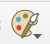
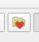

# paraview-adcirc-vis
Python code to help with visualization of ADCIRC results using ParaView. This code automates actions such as zooming in to a specific area of interest, setting location labels, and adding wind vectors to a 2D visualization.

## Summary of contents
- Directories with names ending in ``-vis``: These directories contain Python scripts for different regions of interest in the US (as of December 2020, there is only one directory for regions on the Louisiana-Texas coast)
- ``color-maps``: This directory cotains custom color maps that need to be loaded into ParaView. You should only need to load these color maps once; afterwards, ParaView 
should automatically remember them.
- ``examples``: This directory contains example cases with instructions that can be used to reproduce a sample image.
- This Readme file contains general instructions to load ADCIRC netCDF output files into ParaView. Each ``-vis`` directory has Readme files with more specific instructions about the 
Python scripts.

## Getting started with ParaView visualizations of ADCIRC results
### First steps
- Download ParaView (version 5.8.0 or later)
- (Optional) Change the background color in ParaView. The default background color has a bluish tint so it may not provide enough contrast for visualizations that use large amounts of blue. To change the background color, select the ``Load a color palette`` button in the toolbar, select ``Edit Current Palette ...`` from the drop-down menu, scroll down to the ``Background`` section, and click on ``Background``. You can now specify RGB values. Use 107 for all three for a more neutral gray color.

The ``Load a color palette`` button looks like this: 

### Creating an XDMF file for ADCIRC's NetCDF output
ADCIRC's netCDF output files are not readable by ParaView and need an accompanying XDMF file. The utility for generating this XDMF file is available in the ASGS repository (link to the repository: https://github.com/jasonfleming/asgs) in the output directory. You will need to clone the ASGS repository and in the output directory run this command ( although you will also need to add compiler options specific to the machine you are using): 
```
make all NETCDF=enable NETCDF4=enable NETCDF4_COMPRESSION=enable
```
For example, on Lonestar5 at TACC, the command will be: 
```
make all compiler=intel MACHINENAME=lonestar NETCDF=enable NETCDF4=enable NETCDF4_COMPRESSION=enable
```
You should now have the executable ``generateXDMF.x`` in the output directory. There is one important requirement of the netCDF files to be used with ``generateXDMF.x``: **your ADCIRC output files must be in netCDF4 format**. You can generate netCDF4 output by setting the ``NOUTGE``, ``NOUTGV``, and ``NOUTGW`` parameters to -5 in the ``fort.15`` file.  

The following line is an example of how to use ``generateXDMF.x`` (assuming you have moved the executable to the directory in which you have your ADCIRC output):
```
generateXDMF.x --datafile maxele.63.nc
```
This generates a file named ``maxele.63.nc.xmf``. You can also combine different output files:
```
generateXDMF.x --datafile fort.63.nc --datafile fort.64.nc
```
### Loading color maps into ParaView
- Make sure the XDMF file and the netCDF output file/files that it depends on are in the same directory. Load the XDMF file by using ParaView's File->Open, select the 'XDMF Reader' option when prompted, and click the 'Apply' button.
- Now you can load the two color maps that are in the color-maps directory of this repository. To do this, scroll to the ``Display`` section of the ``Properties`` tab, and under ``Coloring`` select the ``Choose preset`` button. In this pop-up window, use the ``Import`` button to load the two color maps.

The ``Choose preset`` button looks like this: 

### Running Python scripts on ParaView
- To run a Python script, first select View->Python Shell. Then, click on the Python shell so that it loads the necessary information to run scripts. You can now use the 'Run Script' button and select a script from this repository. Refer to the instructions in each directory's readme file, as some scripts must be run in a certain order.

