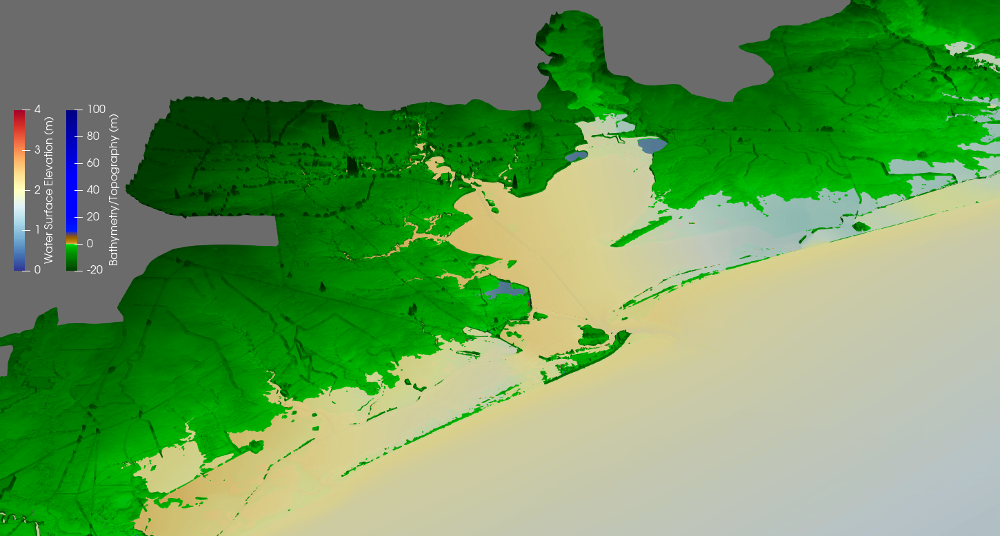
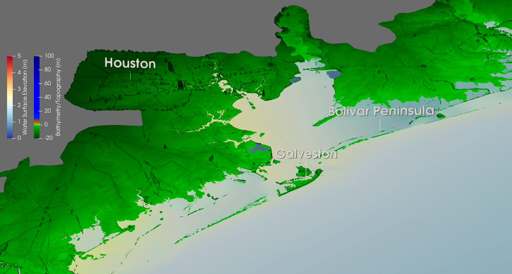

# Houston example: Tropical Storm Beta
The goal of these instructions is to recreate the following visualization of Tropical Storm Beta (2020):

## Step 1: Load ADCIRC output into ParaView
Follow the instructions in the general Readme for this repository to load the ``maxele.63.nc.xmf`` file from this directory into ParaView (skip the 'Creating an XDMF file' step
since here the XDMF file is already provided). These instructions also explain how to load necessary color maps and change ParaView's background color. Make sure to select the green ``Apply`` button.

## Step 2: Apply zoom script
Now run the ``zoomToHouston3D.py`` script from this directory. You can either run it from ParaView's built-in Python shell, or load it as a macro. After running this script, the
visualization should look like this:

## Step 3: Apply labels script
After running the ``labelsHouston.py`` script, the visualization should look like this:

## Step 4: Change upper bound of the water surface elevation color map
Now we will use the ``changeZetaUpBound.py`` script to change the upper bound of the water surface elevation color map from 5 meters to 4 meters. After running this script, a
dialog box should appear on the ParaView GUI prompting you for input; enter the number 4 and click 'OK'. Note that if you run this script from ParaView's Python shell, its effects 
will not be visible until after you close the shell. However, if you run it as a macro, its effects will be immediately visible after clicking 'OK', so it is recommended to run
this script as a macro. 

After changing the water surface elevation color map upper bound to 4, your visualization should look like the first image shown in this Readme.
