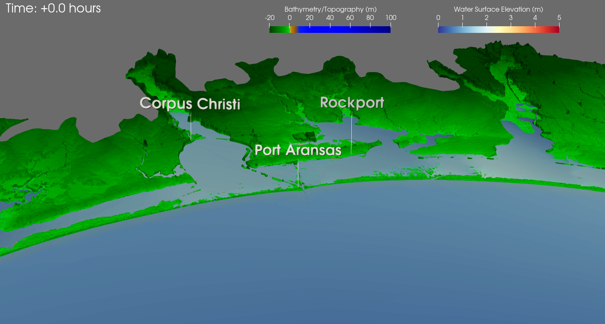

# Visualize ADCIRC results in a 3D view of Corpus Christi and surrounding areas

The scripts in this directory should be used with XDMF files that were created using either of:
1. a ``fort.63.nc`` file (XDMF file name:``fort.63.nc.xmf``)
2. a ``maxele.63.nc`` file (XDMF file name:``maxele.63.nc.xmf``) , or 
3. a ``fort.63.nc`` file followed by a ``fort.74.nc`` file (XDMF file name:``fort.63.nc_fort.74.nc.xmf``). Winds data is not used by any of the scripts in this directory, but the
scripts have been made compatible with this type of input file regardless for convenience.

The ``time`` script can only be used with the first or third options since it only applies to time series data.

Some brief descriptions of what each file does:
- ``zoomToCorpusChristi3D``: This script zooms in to the area of interest, sets color mapping properties, and adjusts the location of the color bars.
- ``labelsCorpusChristi``: Adds labels to important locations such as cities.
- ``timeCorpusChristi``: Adds a time annotation relative to the start of the simulation in hours (first timestep will always read +0 hours).

## Sample Image
Sample image of all scripts used together (visualization of Tropical Storm Beta on TX2008 mesh):

