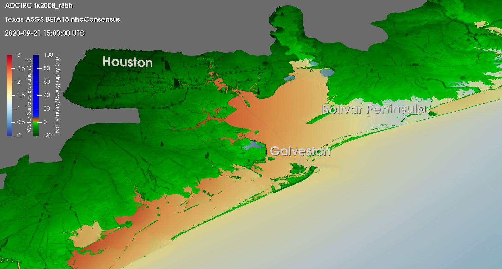
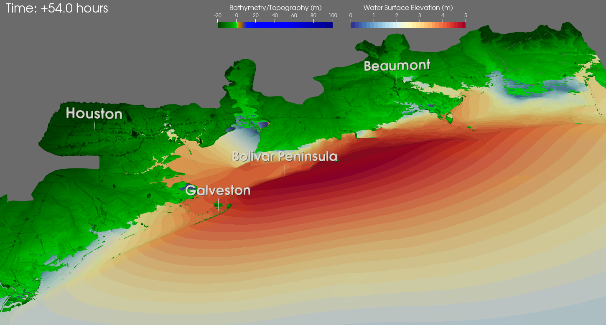

# Visualize ADCIRC results in a 3D view of Houston and surrounding areas

The scripts in this directory should be used with XDMF files that were created using either of:
1. a ``fort.63.nc`` file (XDMF file name:``fort.63.nc.xmf``)
2. a ``maxele.63.nc`` file (XDMF file name:``maxele.63.nc.xmf``) , or 
3. a ``fort.63.nc`` file followed by a ``fort.74.nc`` file (XDMF file name:``fort.63.nc_fort.74.nc.xmf``). Winds data is not used by any of the scripts in this directory, but the scripts have been made compatible with this type of input file regardless for convenience.

Some brief descriptions of what each file does:
- ``zoomToHouston3D`` and ``zoomToHoustonBeaumont3D``: These scripts zoom in to the area of interest, set color mapping properties, and adjust the location of the color bars.
- ``labelsHouston`` and ``labelsHoustonBeaumont``: Add labels to important locations such as cities/peninsulas/lakes.
- ``timeHouston``: Adds a time annotation relative to the start of the simulation in hours (first timestep will always read +0 hours). Compatible with both the Houston scripts and
the Houston/Beaumont scripts.

## Sample Images
Sample image of all scripts used together for the Houston versions (visualization of Hurricane Ike on TX2020a mesh):

Sample image of all scripts used together for the Houston/Beaumont versions (visualization of Hurricane Ike on TX2020a mesh):

