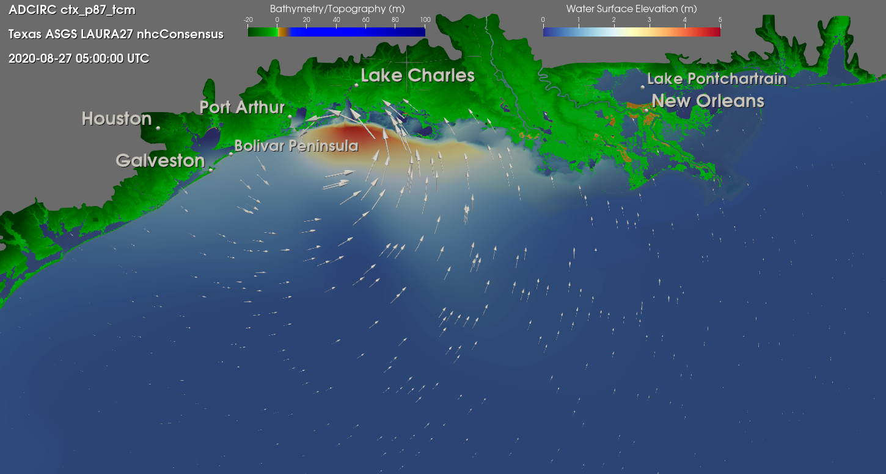
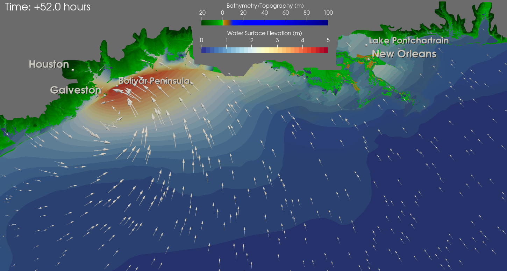

# Visualize ADCIRC results in a 2D general view of the LA-TX coast

The scripts in this directory should be used with XDMF files that were created using either of:
1. a ``fort.63.nc`` file (XDMF file name: ``fort.63.nc.xmf``)
2. a ``maxele.63.nc`` file (XDMF file name: ``maxele.63.nc.xmf``) , or 
3. a ``fort.63.nc`` file followed by a ``fort.74.nc`` file (XDMF file name ``fort.63.nc_fort.74.nc.xmf``). 

The ``windVec`` script can only be used with the third of these options since it must contain winds data. The ``relTime`` script can only be used with the first or third options since it only applies to time series data.

Some brief descriptions of what each file does:
- ``zoomToLATX2D-LL`` and ``zoomToLATX2D-ML``: These scripts zoom in to the area of interest, set color mapping properties, and adjust the location of the color bars.
The abbreviations 'LL' and 'ML' stand for 'less land' and 'more land'; the reason is that some meshes show more inland Louisiana area and others cut out some of that area. This
leads to some differences in location labels and the positioning of the color bars. These differences can be seen in the sample images below.
- ``labelsLATX2D-LL`` and ``labelsLATX2D-ML``: Add labels to important locations such as cities/peninsulas/lakes, with the same distinction between 'LL' and 'ML' as
described above.
- ``windVecLATX2D``: Adds scaled wind vectors and is compatible with any mesh.
- ``relTimeLATX2D``: Adds a time annotation relative to the start of the simulation in hours (first timestep will always read +0 hours). Compatible with any mesh.

## Sample Images
Sample image of all scripts (except `relTimeLATX2D`) used together for the 'ML' versions (also uses the `fullAnnotation` utility):

Sample image of all scripts used together for the 'LL' versions (visualization of Hurricane Ike; also uses the `discretizeZetaMap` utility):

